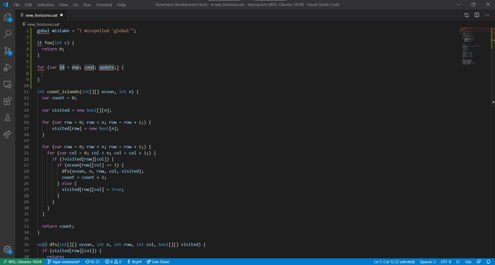

# Oat extension for Visual Studio Code

A Visual Studio Code extension with language support for the Oat language (Princeton COS320/UPenn CIS341), including features such as syntax highlighting, error highlighting, and code completion.

## Features

- Syntax highlighting for the Oat Language

- Basic syntax error checking

- Code Completion for common constructs

## Configuration

- `oat.compiler.version`: set to 1 for Oat V1 and 2 (default) for Oat V2

## Known Issues

None

## Version History

### 0.0.1

Initial release.  Supports Oat V1.

### 0.1.0

-Fixes for loop code completion

-Enables multiple-error detection

### 0.1.1

- Adds setting to change to Oat V2

- Adds typechecking for Oat V2

- Sets Oat V2 as default

## Relation to COS320/CIS341

This extension incorporates logic from the Oat compiler created across the assignments of COS320/CIS341 with permission from Steve Zdancewic.

This extension is mostly a wrapper around an Oat compiler which has been converted to a library and transpiled to Javascript.  This lets it expose itself to a Visual Studio Code extension as a function that takes input files and returns the results of compilation.

The only substantial change to the compiler is that this version can recover from parsing errors to find more syntax errors later in a file.

## Roadmap

This project is progressing in-step with the Spring 2020 semester of COS320.  Expect new features added to the compiler to find their way into the extension about a week after the due date of their respective assignments.

## Other Editors

This extension is implemented using the Language Server Protocol, meaning that it can be used with other editors (Atom,Emacs,Vim,etc), provided a language client is installed.  This project is the server and the language client for VS Code.
